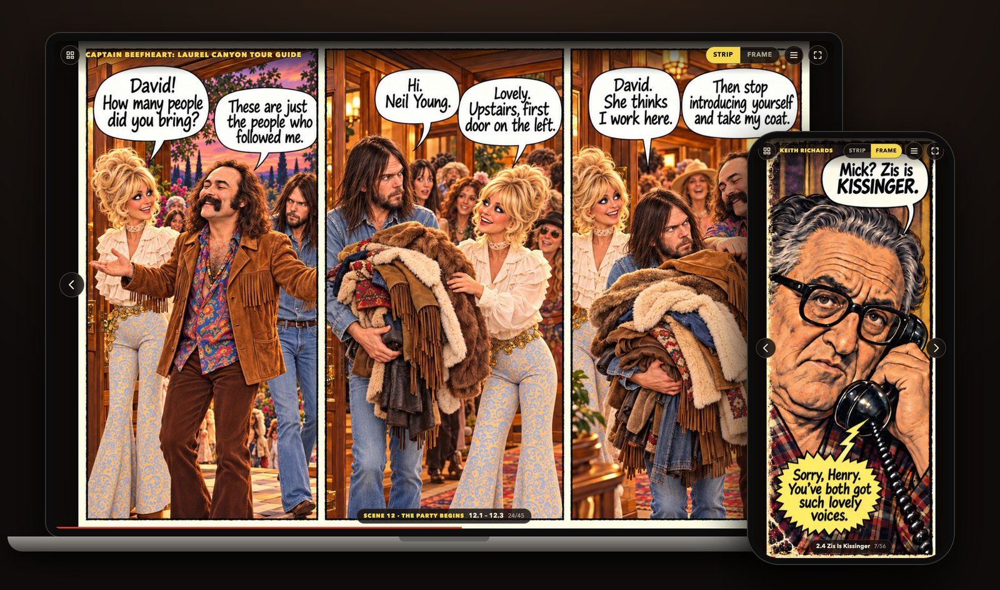
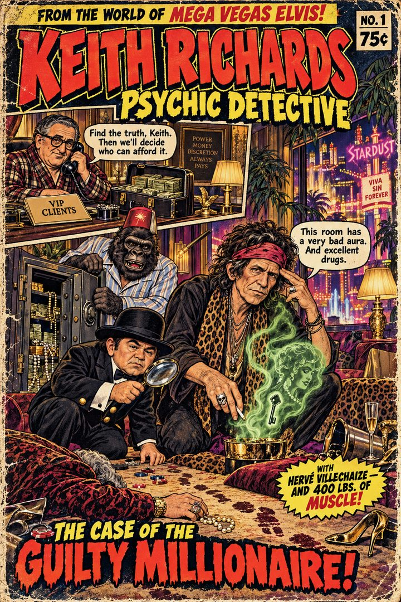
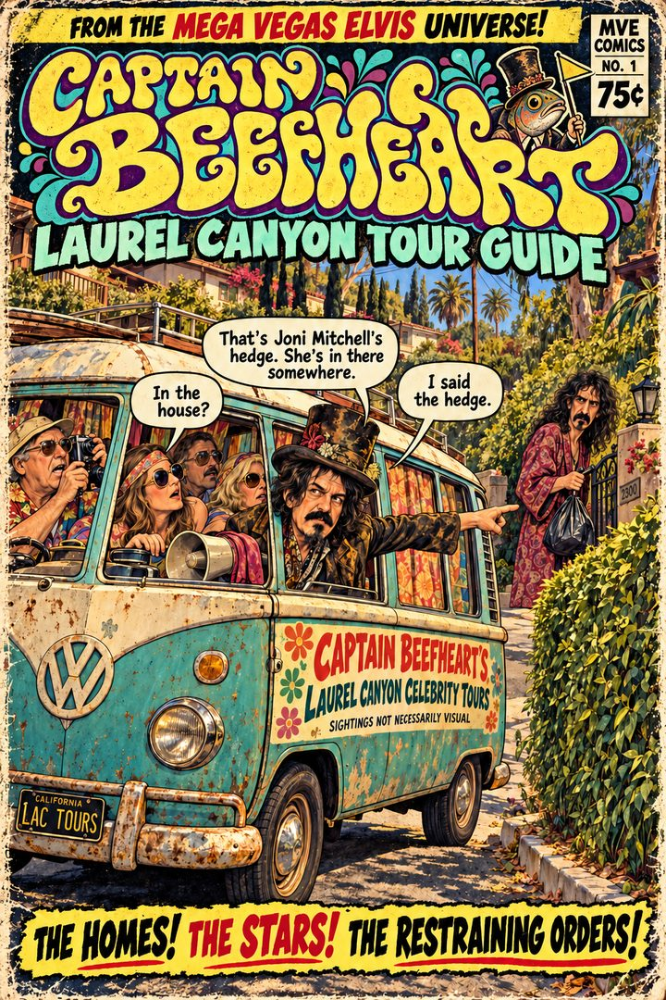
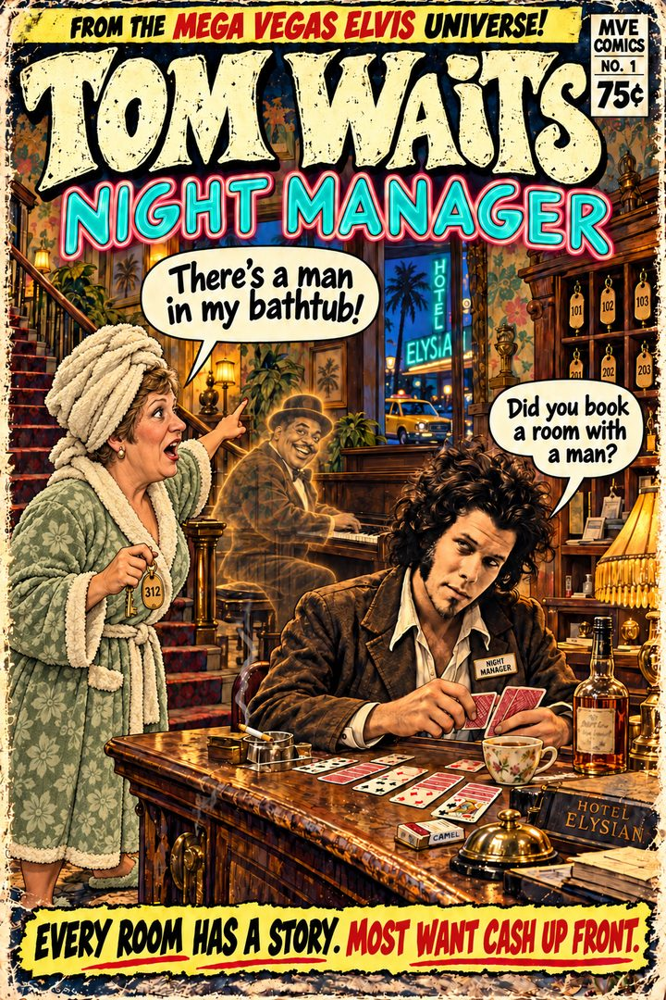
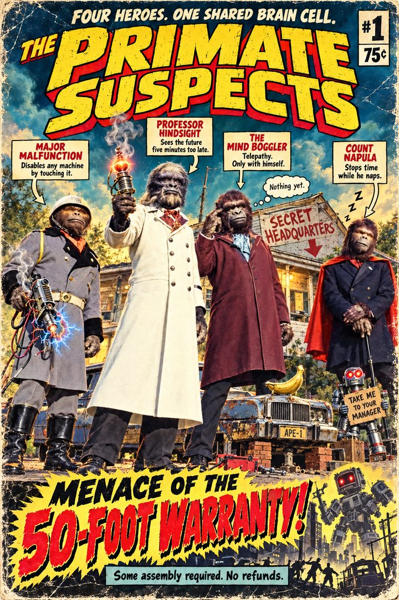
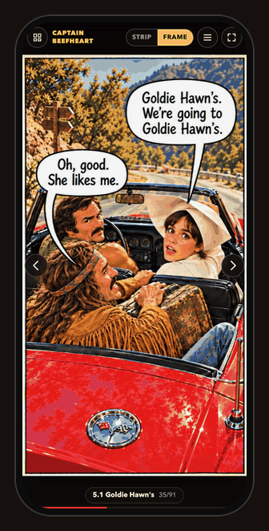
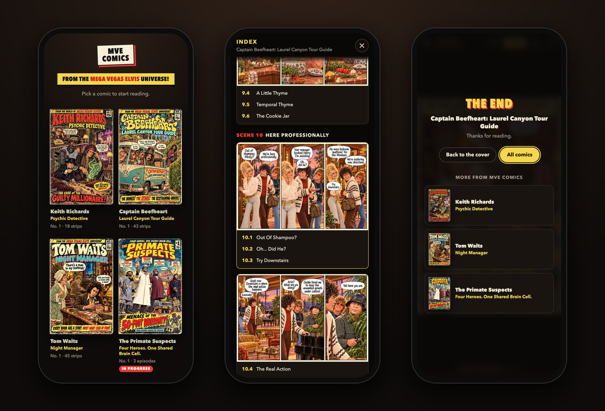

<h1 align="center">MVE Comics</h1>

<p align="center">
  Comics from the <b>Mega Vegas Elvis Universe</b>, where music legends take on some very unlikely side jobs.<br>
  They come with a small web reader that fits any screen, from a laptop to a phone.
</p>

<p align="center">
  <a href="https://arnegleason.github.io/keith-psychic-detective/"><b>Read the comics</b></a>
</p>

<p align="center">
  <a href="https://arnegleason.github.io/keith-psychic-detective/"></a>
</p>

## The comics

<p align="center">
  <a href="https://arnegleason.github.io/keith-psychic-detective/#keith-richards"></a>
  <a href="https://arnegleason.github.io/keith-psychic-detective/#captain-beefheart"></a>
  <a href="https://arnegleason.github.io/keith-psychic-detective/#tom-waits"></a>
  <a href="https://arnegleason.github.io/keith-psychic-detective/#primate-suspects"></a>
</p>

### Keith Richards: Psychic Detective
**No. 1: The Case of the Guilty Millionaire** · Complete · 18 strips · [Start reading](https://arnegleason.github.io/keith-psychic-detective/#keith-richards)

The red phone rings. It's Henry Kissinger, mid-pedicure, with a job. A body has turned up at
Ambassador Boris Backhandov's private reception in Las Vegas, and the ambassador will pay
generously for the truth, provided it leaves him out of it. Keith takes the case, with
Hervé Villechaize and 400 lbs. of muscle.

### Captain Beefheart: Laurel Canyon Tour Guide
**No. 1: The Homes! The Stars! The Restraining Orders!** · Complete · 43 strips · [Start reading](https://arnegleason.github.io/keith-psychic-detective/#captain-beefheart)

Captain Beefheart runs celebrity tours of Laurel Canyon from a rusty VW bus. Sightings not
necessarily visual. Today he recruits Clint, a waiter from El Coyote, into his band, dresses him
from Vincent Price's wardrobe, and heads for Goldie Hawn's party, mostly for the piano. Meanwhile,
in Goldie's kitchen, the stuffed mushrooms are getting a pinch of Temporal Thyme. By the end of
the night, Dennis has flooded the waterfall again, and Clint finds out what the plunger was for.

### Tom Waits: Night Manager
**No. 1: Every Room Has a Story. Most Want Cash Up Front.** · Complete · 45 strips · [Start reading](https://arnegleason.github.io/keith-psychic-detective/#tom-waits)

San Diego, 1973. Tom works the night desk at the Hotel Elysian, and sends a ghost named Fats when
something needs doing. Over one long night, Slim Pickens grills liver under Chuck Connors's window,
William Shatner sings for room service, and Doris and Mary help themselves to the guests' jewelry on
tips from Fats. Vincent Price buys a wish-granting idol, Fats makes it float, and by sunrise Johnny
Carson has fired Tom and his hotel security man, Don Knotts. For the second time this month.

### The Primate Suspects
**Four Heroes. One Shared Brain Cell.** · In progress · 3 episodes so far · [Start reading](https://arnegleason.github.io/keith-psychic-detective/#primate-suspects)

Major Malfunction disables any machine by touching it. Professor Hindsight sees the future five
minutes too late. The Mind Boggler has telepathy, but only with himself. Count Napula stops time
while he naps. Unlike the other comics, this one is a run of standalone one-page episodes, each a
page of four panels, about breakfast, bananas and laundry going wrong at their secret headquarters.

## Reading on any screen



The reader fits each comic to the screen it's on.

- **On a laptop** you see a whole strip or page at a time.
- **On a phone** it goes frame by frame. Each move slides along the strip with a touch of
  motion blur, so you always know where you are in the page. A full-page episode opens on
  the whole page, then zooms into each panel in reading order.
- **Getting around.** Tap the right or left side of the screen, swipe, or use the arrow keys.
  Tap the middle to hide the controls.
- **Strip or Frame.** The reader picks a mode to suit the screen, and the switch at the top
  changes it. For a comic made of full pages, the switch reads Page and Frame.
- **Index.** Every frame has a scene number and a short name, like *2.4 Zis Is Kissinger*.
  The index lists them all and jumps straight to any one.
- **Picks up where you left off.** The shelf remembers where you stopped in each comic.
- **Share a moment.** Every frame has its own link, such as
  [`#keith-richards/p4f1`](https://arnegleason.github.io/keith-psychic-detective/#keith-richards/p4f1).

| Key | Action |
|---|---|
| <kbd>→</kbd> <kbd>↓</kbd> <kbd>Space</kbd> | Next |
| <kbd>←</kbd> <kbd>↑</kbd> | Previous |
| <kbd>S</kbd> | Switch between strip or page, and frame |
| <kbd>I</kbd> | Index |
| <kbd>F</kbd> | Full screen |
| <kbd>Home</kbd> <kbd>End</kbd> | First or last |

<br clear="right">

<p align="center">
  
</p>
<p align="center"><sub>The shelf of covers, the index, and what you see after the last page.</sub></p>

## How it works

The reader is three static files, `index.html`, `viewer.css` and `viewer.js`, with no framework and
nothing to install. GitHub Pages serves the repository as it is, so publishing is just a push.

The comics are prepared ahead of time by `tools/build.py`:

1. **It finds the panels.** It looks for the cream-colored gutters between panels, so nobody
   has to draw frame boxes by hand. A strip is split where gutters run its full height. A full
   page is split into rows first, then each row into panels, and a title banner across the top
   is left out.
2. **It makes web images.** It writes optimized JPEGs, thumbnails and covers. The original PNGs
   come to about 340 MB and the web versions to about 52 MB. The reader then loads only the
   pages near where you are.
3. **It writes the data.** It combines the panels with the scene and frame names from each
   comic's story file into the `comic.json` the reader uses.
4. **It makes the link preview.** `social.jpg` shows every cover when someone shares the link.

| Path | What it is |
|---|---|
| `source-images*/` | The original artwork, one folder per comic. Subfolders are never read |
| `tools/library.json` | The shelf title and the order of the comics |
| `tools/stories/<comic>.json` | One per comic: its source folder, scenes and frame names |
| `tools/build.py` | Finds the panels and writes everything in `comics/` |
| `tools/preview.py` | Serves the site on your computer so you can check it before pushing |
| `comics/` | Build output. Do not edit by hand |
| `screenshots/` | Images for this README |

## Adding strips and comics

The build needs Python with the Pillow and numpy packages.

```bash
pip install pillow numpy
python3 tools/build.py
```

### Previewing before you push

This opens the site from your own computer, the way GitHub Pages will serve it once you push.
It needs only Python.

```bash
python3 tools/preview.py
```

Add `--phone` to check it on a phone on the same Wi-Fi. The script prints the address to open
there, and tells you what hasn't been pushed yet. Stop it with Ctrl+C. Nothing goes public
until you push.

```bash
git push
```

### Adding strips to a comic

1. Drop the new images into the comic's source folder.
2. Run the build. Images the story file doesn't name yet are added at the end under
   "New Pages", with numbered frames, and the build lists them.
3. To name them, add a line per image to the `pages` list in `tools/stories/<comic>.json`,
   with one name per panel, then build again. Add a new entry to `scenes` if the strip
   starts a new scene.

```json
{"file": "New Strip - 12.png", "kind": "strip", "scene": "s4", "frames": ["First Frame", "Second Frame", "Third Frame"]}
```

Files are listed in reading order, so a redrawn strip such as `10a.png` just replaces
`10.png` in its line. A strip can have one, two or three panels. Give it one name per panel.

When a comic is finished, add its end page with `"kind": "end"` and change `"status"`
from `"in-progress"` to `"complete"`. The last page then says "The End" instead of
"To be continued".

### Adding a new comic

1. Put its images in a new folder, for example `source-images-new-comic/`.
2. Copy one of the files in `tools/stories/` to `tools/stories/new-comic.json`. Set its
   title, `source` folder, scenes and pages.
3. Add `"new-comic"` to the `comics` list in `tools/library.json`. The shelf follows that order.
4. Run the build.

For a comic of standalone one-page episodes, like The Primate Suspects, add `"format": "pages"`
to its story file and give each page `"kind": "page"` and its own scene. Its scenes are then
called episodes. A new page dropped into its folder before it's named becomes a new episode,
titled from its file name, so `04-the-big-heist.png` shows up as Episode 4, "The Big Heist".

```json
{"file": "04-the-big-heist.png", "kind": "page", "scene": "e4", "frames": ["First", "Second", "Third", "Fourth"]}
```

### Keeping reference images

A folder of reference images can live inside a comic's source folder, for example
`source-images-primate-suspects/reference images/`. The build never reads subfolders, so they
stay out of the reader. Any folder there whose name contains "reference" is also left out of git,
so it stays on your computer and isn't published with the site.

### When the build complains

- **Found 2 panels but the story names 3.** The artwork probably covers a gutter, as the
  green glow does on Keith Richards page 13. Add the gutter positions by hand to that page's
  line, as `"gutters": [[508, 516], [1012, 1022]]`. Each pair is the left and right pixel
  edge of one gutter between panels.
- **Listed but not found.** A file named in the story file is missing from the source folder.
  Check the spelling, including spaces.
- To leave an image in the folder out of the comic, add its file name to a `"skip"` list
  in the story file.
